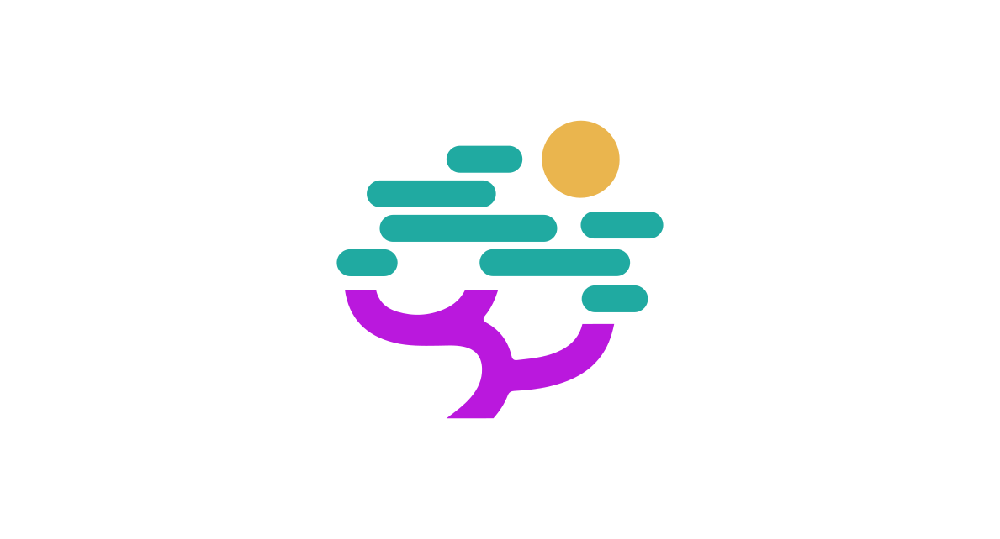

<div align="center">
  <h1>
    &nbsp;Nebari design
  </h1>

  <p>
    A <a href="https://ui.shadcn.com/docs/registry">shadcn component registry</a> styled with the Nebari brand,<br>
    and the home of the Nebari project's design assets.
  </p>

  <p>
    <a href="https://github.com/nebari-dev/nebari-design/actions/workflows/ci.yml"></a>
    <a href="https://github.com/nebari-dev/nebari-design/actions/workflows/pages.yml"></a>
    <a href="https://nebari-dev.github.io/nebari-design/"></a>
    <a href="https://ui.shadcn.com/docs/registry"></a>
    <a href="./LICENSE"></a>
  </p>

  <p>
    <a href="https://nebari-dev.github.io/nebari-design/"><strong>Storybook</strong></a> ·
    <a href="#install"><strong>Install</strong></a> ·
    <a href="#whats-in-the-registry"><strong>Catalog</strong></a> ·
    <a href="#contributing"><strong>Contributing</strong></a> ·
    <a href="#design-assets"><strong>Design assets</strong></a>
  </p>
</div>

---

Browse every component, with docs and live examples, in the deployed Storybook:
<https://nebari-dev.github.io/nebari-design/>. The installable registry JSON is
served from the same Pages build under `/r/`.

## Component registry

Components are distributed as **source**, not as a published npm package. The
`shadcn` CLI copies each item into your app, where you own the code and can
adjust it freely.

### Install

Register the `@nebari` namespace once in your project's `components.json` so the
`shadcn` CLI knows where to resolve `@nebari/<name>` items:

```json
{
  "registries": {
    "@nebari": "https://nebari-dev.github.io/nebari-design/r/{name}.json"
  }
}
```

Then add any item:

```sh
npx shadcn add @nebari/<name>
```

For example, to install the shared `cn()` utility and the Nebari theme tokens:

```sh
npx shadcn add @nebari/utils
npx shadcn add @nebari/theme
```

Installing a component automatically pulls in its registry dependencies — adding
`@nebari/button` also installs `@nebari/utils`, `@nebari/spinner`, and
`@nebari/theme` if they aren't present yet.

### What's in the registry

The manifest in [`registry.json`](./registry.json) is the source of truth for
installable items; each one is documented in
[Storybook](https://nebari-dev.github.io/nebari-design/). The catalog currently
covers:

- **Foundations** — `utils` (the `cn()` helper), `date-utils` (calendar-date
  arithmetic, comparison, formatting, and parsing helpers), `theme` (brand color
  tokens and radius for light and dark modes), and `claude-skill` (see below).
- **Hooks** — `use-theme-preference` (a hook + `ThemeProvider` that persists a
  light/dark/system preference and follows the OS).
- **Forms & inputs** — `button`, `button-group`, `input`, `textarea`, `label`,
  `field`, `checkbox`, `radio-group`, `switch`, `slider`, `select`, `combobox`,
  `calendar`, `date-picker`.
- **Overlays & menus** — `dialog`, `drawer`, `dropdown-menu`, `tooltip`,
  `toast`.
- **Navigation & layout** — `navigation-menu`, `breadcrumb`, `tabs`, `sidebar`,
  `accordion`.
- **Feedback & display** — `alert`, `badge`, `card`, `table`, `data-table`,
  `code-block`, `spinner`, `skeleton`.

### Fonts

The theme tokens in `registry/nebari/globals.css` set `--font-sans` to
[**Geist**](https://vercel.com/font) and `--font-mono` to
[**IBM Plex Mono**](https://www.ibm.com/plex/). The theme only _references_ these
families — install the webfonts in your app so they actually load:

```sh
npm i @fontsource-variable/geist @fontsource/ibm-plex-mono
```

Then import them once at your app's entry point:

```ts
import '@fontsource-variable/geist';
import '@fontsource/ibm-plex-mono/400.css';
import '@fontsource/ibm-plex-mono/500.css';
```

Skip this and the tokens gracefully fall back to the system `sans-serif` /
`monospace` stacks.

### Claude Code skill for consumers

If you build your app with [Claude Code](https://docs.claude.com/en/docs/claude-code/skills),
install the Nebari UI skill into your project so the assistant knows how to set
up the registry, which components exist, and how to use and theme them:

```sh
npx shadcn add @nebari/claude-skill
```

This drops a skill at `.claude/skills/nebari-ui/SKILL.md` in your repo (distinct
from the contributor authoring skill below, which lives in _this_ repo). Once
installed it auto-triggers on requests like "add the nebari button" or "build a
form with nebari components", and stays current through the same `shadcn add`
flow as the components themselves.

## Contributing

### Development

This project uses [Bun](https://bun.sh/), [TypeScript](https://www.typescriptlang.org/),
[Tailwind CSS v4](https://tailwindcss.com/), and [Base UI](https://base-ui.com/)
primitives. The `@/*` path alias resolves to `registry/nebari`, and
`@/components/ui/*` resolves to `registry/nebari/ui/*` so registry sources import
siblings exactly as the shadcn CLI emits them.

```sh
bun install              # install dependencies
bun run storybook        # component workbench on http://localhost:6006
bun run build:registry   # build the registry into public/r
bun run check            # biome lint + format checks (check:fix to auto-fix)
```

Every change must pass the verification gate before it's done. CI runs the same
sequence on every pull request:

```sh
bun run build:registry   # registry.json is valid and the item builds into public/r
bun run check            # biome lint + format (use check:fix to auto-fix)
bunx tsc --noEmit        # types pass
bun run test             # unit tests pass
```

### Registry layout

| Path                          | Purpose                                                              |
| ----------------------------- | -------------------------------------------------------------------- |
| `registry.json`               | Registry manifest — the source of truth for installable items.       |
| `registry/nebari/ui/`         | UI components (`registry:ui`).                                       |
| `registry/nebari/hooks/`      | Shared non-visual logic, e.g. theme state (`registry:hook`).         |
| `registry/nebari/lib/`        | Shared library code: the `cn()` helper and date utils (`registry:lib`). |
| `registry/nebari/globals.css` | Theme source of truth; `bun run sync:theme` derives the `theme` item. |
| `registry/nebari/skills/`     | Consumer-facing Claude Code skills (`registry:file`).                |
| `stories/`                    | Storybook stories and MDX docs pages.                                |
| `tests/`                      | Vitest suites, mirroring `stories/`.                                 |
| `public/r/`                   | Built, installable JSON artifacts produced by `build:registry`.      |

### Adding a component

This repo ships a [Claude Code skill](https://docs.claude.com/en/docs/claude-code/skills)
at `.claude/skills/nebari-component/` that encodes the house recipe for adding a
component to the registry — the component file pattern (`cva` variants,
`data-slot` attributes, `cn()` merging, Base UI `render`-prop composition), the
`registry.json` entry shape, story and test templates, and the verification
gate. Any contributor using Claude Code gets it automatically; invoke it with
`/nebari-component` or just ask to "add a `<X>` component to the registry".

### Design-to-code with Figma

Because the Nebari brand and components originate in design, we recommend
installing the [Figma MCP server](https://help.figma.com/hc/en-us/articles/32132100833559-Guide-to-the-Dev-Mode-MCP-Server)
when working on registry components with an AI coding assistant. It lets the
assistant read a Figma frame's layout, styles, and design tokens directly,
so generated components stay faithful to the source design and aligned with
the Nebari brand colors and fonts. Pair it with the `/nebari-component` skill
above: pull the design context from Figma, then scaffold the component using
the house recipe.

### Storybook

Storybook is the local workbench for registry components and the published docs
site for this repo. Run it with Bun:

```sh
bun run storybook
```

The dev server runs at <http://localhost:6006>. Stories live in the top-level
`stories/` directory, including MDX docs pages and component stories named
`*.stories.tsx`. Storybook uses the same Tailwind v4 setup and `@/*` /
`@/components/ui/*` aliases as the registry source, so imports resolve the same
way they do in tests and builds.

Component stories follow a shared controls pattern. `Default` is the interactive
playground and exposes the documented knobs; every other story narrows controls
with `parameters.controls.include` to the props that apply to it — its own
subject plus whatever its render leaves live — and uses `[]` only where nothing
is adjustable. Every knob is seeded in the meta `args` with the component's own
default, so controls open as populated widgets rather than click-to-reveal "Set
…" buttons; a prop whose unset state is meaningful gets an explicit `auto`
option instead. Consumer composition APIs such as Base UI's `render` prop remain
visible in the props table with `control: false`, while implementation plumbing
is hidden. The full authoring recipe is in
`.claude/skills/nebari-component/SKILL.md`, and
`tests/story-controls.test.ts` enforces the parts that can be checked
statically.

The preview loads the Nebari theme tokens and webfonts, enables autodocs for
every component, and includes a toolbar switcher for light and dark themes. The
custom toolbar is retained instead of adding a second addon switch: its `theme`
global is the single source of truth for both the preview and manager UI.
`initialGlobals.theme` defaults both contexts to light, and `.storybook/manager.ts`
maps updates to manager colors aligned with the semantic tokens in
`registry/nebari/globals.css`. Theme persistence across reloads is not provided.
The a11y addon runs axe checks in the UI and fails the Storybook Vitest project
when violations are found.

```sh
bun run test:storybook   # render every story in Chromium with a11y checks
bun run build:storybook  # build the static Storybook site into public/
bun run build:pages      # build Storybook plus registry JSON for GitHub Pages
```

Pushes to `main` deploy the Pages build automatically via
[`.github/workflows/pages.yml`](./.github/workflows/pages.yml).

### Testing

Components are tested with [Vitest](https://vitest.dev/),
[Testing Library](https://testing-library.com/docs/react-testing-library/intro/),
and `jsdom`. Vitest reuses the same `@vitejs/plugin-react`, Tailwind, and `@` →
`registry/nebari` / `@/components/ui` → `registry/nebari/ui` alias setup as the
registry and Storybook, so tests resolve imports exactly like the app does.

```sh
bun run test            # run the suite once
bun run test:watch      # watch mode
bun run test:coverage   # run with a coverage report
```

Test files live in the top-level `tests/` directory (mirroring `stories/`),
named `*.test.ts` / `*.test.tsx`. Coverage of `registry/nebari` is enforced at a
minimum of 80% for lines, functions, branches, and statements.

## Design assets

This repository also contains the design assets for the Nebari project, created
in Adobe Illustrator.

The assets are available in two formats (PNG & SVG) and in three layouts —
horizontal (landscape), stacked (closer to square), and symbol (the mark alone,
without the name) — each in at least three versions (color, white text, and
colored background).

| Asset                                                   | Location                                                     |
| ------------------------------------------------------- | ------------------------------------------------------------ |
| Nebari symbol                                           | [`symbol/`](./symbol/)                                       |
| Nebari symbol with colored backgrounds                  | [`symbol/colored-background/`](./symbol/colored-background/) |
| Nebari horizontal logo mark                             | [`logo-mark/horizontal/`](./logo-mark/horizontal/)           |
| Nebari stacked logo mark                                | [`logo-mark/stacked/`](./logo-mark/stacked/)                 |
| Nebari logo mark with colored backgrounds               | [`logo-mark/colored-background/`](./logo-mark/colored-background/) |

## Acknowledgements

The original designs were created by the very talented [Irina Fumarel](https://irinafumarel.ro/) 💜.

## License

<a rel="license" href="http://creativecommons.org/licenses/by-nc-nd/4.0/"></a><br /><span xmlns:dct="http://purl.org/dc/terms/" href="http://purl.org/dc/dcmitype/StillImage" property="dct:title" rel="dct:type">All Nebari design assets </span> by the <a xmlns:cc="http://creativecommons.org/ns#" href="https://nebari.dev" property="cc:attributionName" rel="cc:attributionURL">Nebari dev team</a> are licensed under a <a rel="license" href="http://creativecommons.org/licenses/by-nc-nd/4.0/">Creative Commons Attribution-NonCommercial-NoDerivatives 4.0 International License</a>.<br /> Based on a work at <a xmlns:dct="http://purl.org/dc/terms/" href="https://github.com/nebari-dev/nebari-design" rel="dct:source">https://github.com/nebari-dev/nebari-design</a>.
